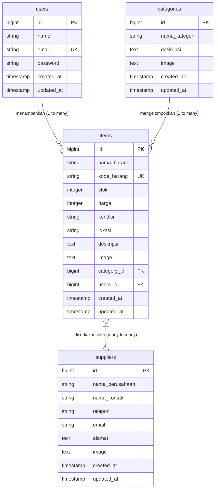

# InvenTrack — Sistem Inventaris Barang
> **Ujian Tengah Semester (UTS) Praktikum Rekayasa Perangkat Lunak**
> Universitas HKBP Nommensen

---

## 👤 Identitas Mahasiswa
* **Nama Lengkap:** [Esther Laura Rumahorbo]
* **NIM:** [2302050042]
* **Kelas:** [RPL-3]
* **Program Studi:** ilmu komputer
* **Dosen Pengampu:** [Juni Ismail M. Kom.]

---

## 📝 Deskripsi Proyek
**InvenTrack** adalah web aplikasi pengelolaan inventaris barang sederhana yang dirancang khusus untuk memenuhi penilaian praktikum Rekayasa Perangkat Lunak (RPL). Aplikasi ini dibangun menggunakan framework **Laravel 13** dan **Filament 5** admin panel.

Sistem ini memudahkan Admin/Pengguna untuk melakukan pengelolaan data inventaris secara real-time, meliputi kategori barang, detail stok, lokasi penyimpanan, serta hubungan logistik dengan berbagai supplier/pemasok eksternal.

---

## 🗄️ Struktur Database & Relasi Tabel
Sistem ini menggunakan database `db_inventrack` yang terdiri dari **4 tabel utama**:



### Penjelasan Relasi:
1. **`users` ──── (1:N) ────> `items`**: Setiap admin (user) dapat menambahkan banyak barang ke dalam sistem. Kolom `users_id` pada tabel `items` terhubung ke `users.id` dengan relasi `cascadeOnDelete`.
2. **`categories` ──── (1:N) ────> `items`**: Setiap barang dikelompokkan ke dalam satu kategori logistik (Elektronik, Furniture, ATK, dll.).
3. **`items` ──── (N:M) ────> `suppliers`**: Relasi banyak-ke-banyak (Many-to-Many) antara barang dan supplier/pemasok menggunakan tabel pivot `item_supplier`.

---

## 🚀 Fitur Utama & Panduan CRUD Filament 5
Aplikasi ini menyediakan halaman panel administrasi modern dengan antarmuka premium:
* **Autentikasi Aman:** Dilengkapi login screen terintegrasi menggunakan middleware autentikasi bawaan Filament.
* **Manajemen Kategori (Categories):** Pencarian, pengurutan, deskripsi visual, dan upload ikon kategori yang tersimpan rapi di disk `public`.
* **Manajemen Barang (Items):**
  * Input Kode Barang unik.
  * Form numerik validatif untuk stok dan harga (dengan format mata uang Rupiah `IDR`).
  * Dropdown kondisi fisik barang (`Baik`, `Rusak Ringan`, `Rusak Berat`) dengan penanda visual **Badge Berwarna** (*Success*, *Warning*, *Danger*).
  * Dropdown lokasi gudang penyimpanan (`Gudang A`, `Gudang B`, `Gudang C`) dengan **Badge**.
  * Pengisian otomatis `users_id` secara tersembunyi (*hidden*) berdasarkan akun yang sedang aktif login.
* **Manajemen Supplier (Suppliers):** Data kontak lengkap perusahaan, email dengan format validatif, nomor telepon, alamat, dan logo perusahaan.

---

## 🛠️ Langkah Menjalankan Proyek Secara Lokal

### 1. Kloning Repository
```bash
git clone https://github.com/USERNAME/inventrack.git
cd inventrack_esther
```

### 2. Install Dependensi
```bash
composer install
```

### 3. Konfigurasi Environment (`.env`)
Salin file `.env.example` menjadi `.env` lalu sesuaikan kredensial database Anda:
```env
APP_NAME=InvenTrack
APP_URL=http://localhost:8000

DB_CONNECTION=mysql
DB_HOST=127.0.0.1
DB_PORT=3306
DB_DATABASE=db_inventrack
DB_USERNAME=root
DB_PASSWORD=
```

### 4. Buat Database & Jalankan Migrasi
Pastikan web server lokal Anda (Herd/WAMP/XAMPP) aktif, buat database `db_inventrack`, lalu jalankan:
```bash
php artisan migrate
```

### 5. Generate Storage Symlink
Hubungkan direktori penyimpanan gambar agar file upload dapat diakses secara publik:
```bash
php artisan storage:link
```

### 6. Buat Akun Admin Filament
```bash
php artisan make:filament-user
# Masukkan Name: Admin
# Masukkan Email: admin@admin.com
# Masukkan Password: password
```

### 7. Jalankan Server Lokal
```bash
php artisan serve
```
Akses aplikasi melalui browser Anda pada URL: **`http://localhost:8000/admin/login`**

---

## 💾 Riwayat Git Commit
Riwayat commit pada repository ini terstruktur secara rapi sesuai ketentuan penilaian UTS:
1. `feat: initial project inventrack Laravel 13`
2. `feat: create migrations for categories, items, suppliers`
3. `feat: setup fillable and relationships`
4. `feat: install Filament 5 and generate resources`
5. `feat: customize all Filament resources`
6. `docs: add academic README documentation`

---

## 📸 Dokumentasi Screenshot Pengumpulan
Seluruh screenshot berikut dapat dilihat pada folder `screenshots/` di dalam root direktori proyek ini:
1. **Welcome Screen Laravel** (`screenshots/1_welcome_page.png`)
2. **Struktur Tabel Database Manager** (`screenshots/2_database_tables.png`)
3. **Dashboard Panel Admin Filament** (`screenshots/3_filament_dashboard.png`)
4. **Form Tambah Kategori** (`screenshots/4_create_category_form.png`)
5. **Form Tambah Barang (Items)** (`screenshots/5_create_item_form.png`)
6. **Tabel Daftar Barang** (`screenshots/6_items_list_table.png`)
7. **Form Tambah Supplier** (`screenshots/7_create_supplier_form.png`)
